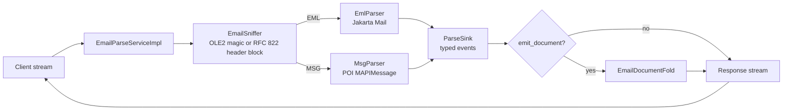

# grpc-email architecture

**Status:** implemented
**Updated:** 2026-08-15

Implementers start at [`AGENTS.md`](../AGENTS.md), then this file, `design.md`, and `guidelines.md`.

## Where this sits

gRParse is the parse coordinator. This service is a **format collector**:
bytes in, a source-tagged `Document` (or a native event stream gRParse
maps into one) out. It is not the CV path, not enrichment, and not the
export sink.

```text
.eml / .msg bytes
        │
        ▼
   grpc-email          RFC 822 body + headers + attachment manifest
        │
        ▼
   gRParse coordinator (COLLECTOR_EMAIL)
        │  attachments fan out as child parses
        ▼
   Document stream  ──►  grpc-enrich (optional)  ──►  protomolt sink
```

LibreOffice does not parse Outlook `.msg`, so this service owns the format
directly, over gRPC and without a Python serving path.

## Live results

A batch converter hands back one document when the whole message (and every
attachment the pipeline will touch) is done. This service emits as parts
land so a UI can paint live: subject and addresses first, then the plain
body, then HTML, then each attachment name as it is listed. The coordinator
forwards those events; it does not buffer the collector until MIME is
exhausted.

## Request flow inside the process



One parse runs on one virtual thread; a semaphore bounds parses in flight
to protect heap. Format detection reads bytes only, never the advisory
content type.

## What this process owns

- Detecting `.eml` (RFC 822) vs `.msg` (OLE2/CFB + MAPI) from **bytes**,
  never from the advisory content type.
- Headers (from/to/cc/bcc, subject, dates, message-id, in-reply-to) as
  typed metadata, not a string blob.
- Body parts: `text/plain` and `text/html`. HTML bodies are **not**
  parsed here; they are emitted as a part so gRParse can send them to
  the HTML collector.
- Optional attachment **listing** (filename, content type, size, content
  id). Binary payloads are not embedded in the `Document` by default;
  they stream as child blobs the coordinator may re-parse.
- Isolation: one parse, one bounded in-memory buffer. Nothing touches
  durable disk. A poisoned message kills this RPC, not gRParse.

## What this process does not own

| Concern | Owner |
|---|---|
| HTML body tree, reading order, links | HTML collector / `grpc-lol-html` projection |
| Attached PDF/DOCX/images | gRParse fans those bytes to the right collector |
| Page rasters, OCR, layout | gRParse CV |
| Picture describe / chart extract | `grpc-enrich` |
| Markdown / HTML / parquet export | protomolt sink |

## Language

**Java**, next to `grPOIc`.

- `.msg` is OLE2 + MAPI. Apache POI already has `HSMF` (`MAPIMessage`)
  in `poi-scratchpad`; that is the library, not a second OLE stack.
- `.eml` is Jakarta Mail (`Session` + `MimeMessage` over a `ByteArrayInputStream`).
- Virtual threads, one parse per request, a semaphore on heap (MIME
  trees are memory-heavy), same concurrency story as `grPOIc`.

## Failure model

gRPC status, never a 200 with a partial lie:

- `INVALID_ARGUMENT`: no bytes, truncated MIME, missing complete flag
- `UNIMPLEMENTED`: not email
- `RESOURCE_EXHAUSTED`: over the byte cap
- `INTERNAL`: parser fault

A failed collector is a `CollectorFailure` on the gRParse stream. It
does not fail the parse while another collector succeeds.
